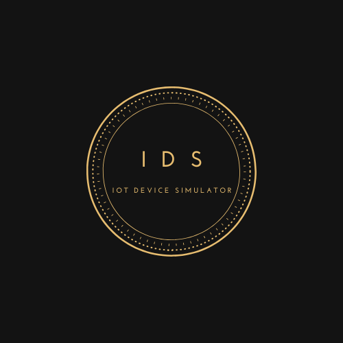
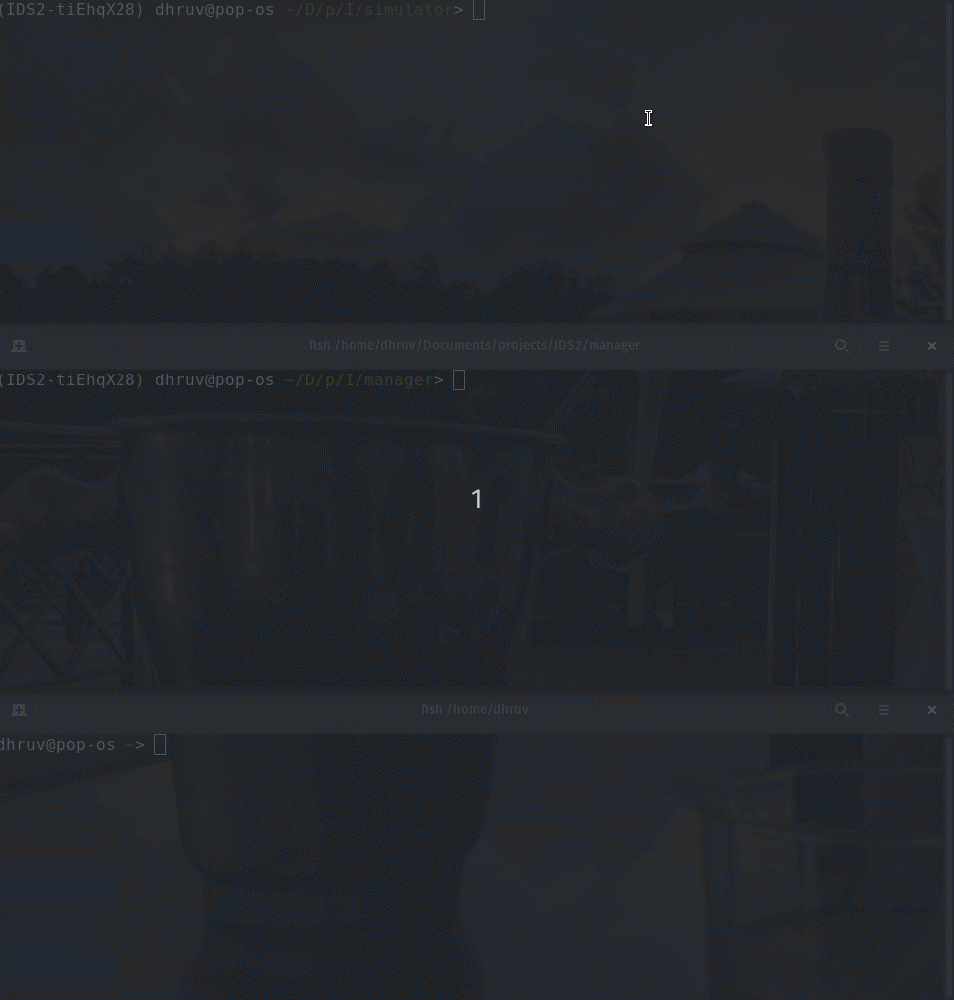
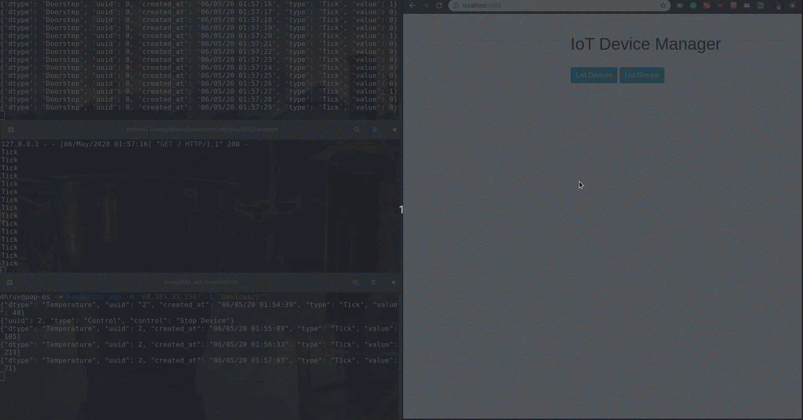
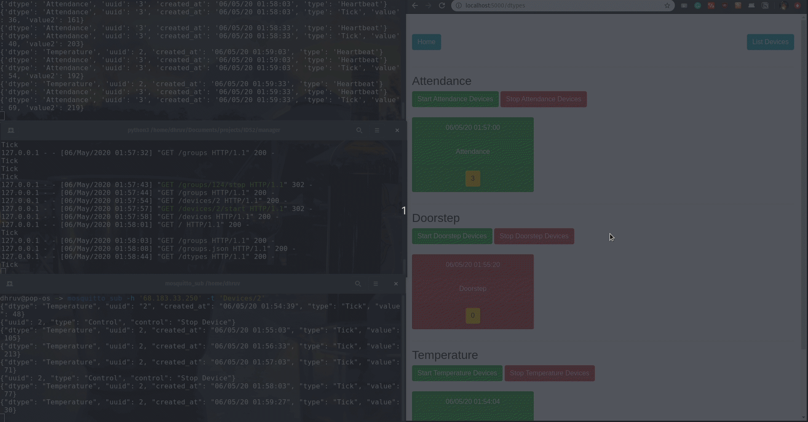
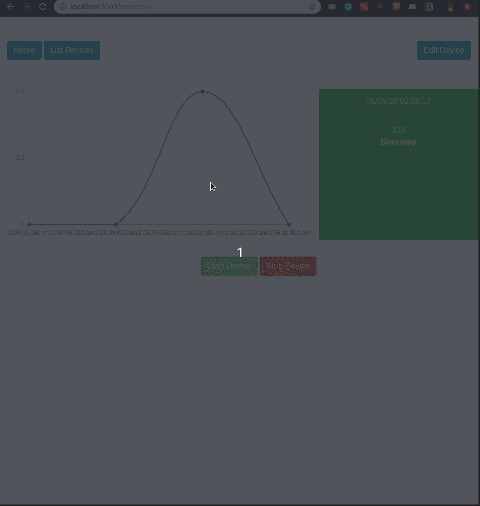

# IOT Device Simulator
## Part Of IAS Hackathon 2  (7th April 2020)
___
> Arjun Nemani

> Dhruv Chauhan
___

Device Layer [Device Manager and Device Simulator] and IoT Component where you can set up and manage your smart devices. 
___

### Data flow:
- Various types of IoT devices are spawned by the Device Simulator
- IoT devices send data to the Device Manager, through a message broker, which acts as a real-time handler of IoT data
- For a device data to be accessible to IoT Platform you must register, connect, and create a device twin for your device in Device Manager
- Device data is written to a cloud database
- Consume entity data with monitoring dashboards
- Use APIs to connect apps to device data
___

### Features:

#### Connect
___
Ingest IoT data in the form of MQTT events from any source (here, Device Simulator). The connect feature lets your applications subscribe to those events to process the event data.

#### Device Management
___

Device addition, removal, and controls - on, off. 

#### Group Management
___
Controlling grouped (by group numbers or device types) devices.

#### Capture
___
Capture your IoT data in the cloud DB.

#### Monitor
___
Get real-time graphs of devices with built-in monitoring dashboards.

#### APIs to connect apps to device data
___

