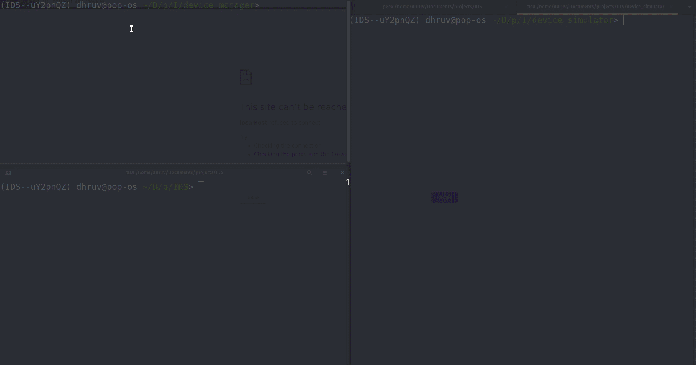

# IOT Device Simulator
## Part Of IAS Hackathon 2  (7th April 2020)
___
> Arjun Nemani

> Dhruv Chauhan
___

Device Layer [ Device Manager and Device Simulator ] that uses MQTT for communication between each other.

The Device Manager takes commands via HTTP exposed web interface OR via Kafka messages sent to the 'DeviceManager' topic. 
It is able to communicate with the sensors (which we assume are running on different machines) and also can command it to turn on or off. 
We also added the functionality to create and destroy sensors on the go, without needing restart of the DeviceSimulator.
Device Manager also supports grouping of the devices into groups which can then be used to for example: "turn off all the devices in group 'room-1' "

To simulate the other components of an IoT-platform, we installed and configured node-red.
We have deployed node-red on the following link http://68.183.33.250:1880/ 
We also have kakfa and mqtt brokers running on the same. 

___
## Demo
- Getting the device-manager, mqtt subscribers, and device-simulator running

___
- device-manager routes to add/view devices

___
- This is the node-red web interface, it allows a user to create flows by hooking up multiple services together.
We have a kafka consumer here which gets messages from our device layer with the relevant data from the devices.
User can create more pipelines to interact with the data or to send it to various other services.
- At the top you can see another flow made by us, this node showcases how we can send commands to the device layer. Again this can be hooked up with any other service and it will work.
The command we are sending here is to add a new time device to our device layer.

___
